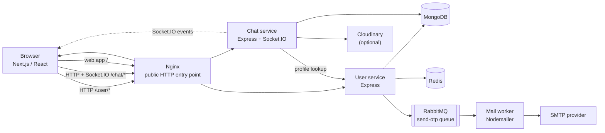

# Mingle Chat App — Application Architecture

## What the application does

Mingle is a web application for finding people, inviting them to join, and having one-to-one conversations. It addresses two common needs:

- **Account access without a password:** users request a one-time code by email and verify it to sign in or create an account.
- **A direct path from invitation to conversation:** a signed invite link identifies its sender. Once the recipient verifies their account, the app creates a chat between them so each person appears in the other's conversation list.

The app also supports real-time text and image messages, delivery/read state, typing indicators, online presence, and per-user contact names.

## Technology at a glance

| Area | Technology | Responsibility |
| --- | --- | --- |
| Web client | Next.js App Router, React, TypeScript | Login and OTP screens, conversation list, friend invites, and chat UI |
| HTTP client and session | Axios, `js-cookie` | Calls the APIs and stores the signed-in user's bearer token in a browser cookie |
| User API | Node.js, Express, TypeScript, Mongoose | OTP login, user profiles, JWTs, and signed invite links |
| Chat API | Node.js, Express, TypeScript, Mongoose | Conversations, contact names, messages, image uploads, and read state |
| Persistent database | MongoDB, Mongoose | User records, chat membership, and message history |
| Temporary key-value storage | Redis | OTP expiry and OTP request rate limiting |
| Email queue | RabbitMQ (`amqplib`) | Passes OTP email jobs from the user API to the mail worker |
| Email delivery | Mail worker, Nodemailer, SMTP | Consumes email jobs and delivers OTP messages |
| Real-time transport | Socket.IO | New-message events, chat updates, read receipts, typing, and online presence |
| Image storage | Cloudinary | Optional hosted storage for chat images |
| Local/reverse-proxy deployment | Docker Compose, Nginx | Runs containers and routes browser/API traffic to the appropriate service |

## Service layout

The user and chat APIs are separate services. Both use the same JWT signing secret to validate bearer tokens. The browser reaches them through their configured public URLs; inside a container network, services use internal service URLs to reach one another.

## Main application flows

### 1. Requesting and verifying an OTP

1. The user enters an email address on the login screen.
2. The browser sends `POST /api/v1/login` to the user service.
3. The user service checks Redis for `otp:ratelimit:<email>`. If present, it returns HTTP 429. Otherwise, it creates a six-digit OTP, stores `otp:<email>` for five minutes, and sets the rate-limit key for 60 seconds.
4. The user service publishes an email job to RabbitMQ's durable `send-otp` queue.
5. The mail worker consumes the job and sends the email via the configured SMTP provider.
6. The user enters the OTP. The browser sends `POST /api/v1/verify`.
7. If the OTP matches, the user service removes it from Redis, finds or creates the MongoDB user record, and returns the user and a signed JWT.
8. The browser stores the JWT in a cookie and loads the user's profile and conversations.

OTP delivery is asynchronous: the HTTP request queues a mail job; SMTP delivery happens in the mail worker.

### 2. Inviting a friend and adding them to the friend list

1. A signed-in user chooses **Invite a friend**. The browser calls the authenticated user-service endpoint `POST /api/v1/invite`.
2. The user service signs a 30-day invite token containing the inviter's user ID and an invite-purpose claim. The browser shares or copies a login URL containing that token.
3. The invited person requests an OTP. The login page carries the invite token forward to the verification page.
4. The browser submits the OTP and invite token to `POST /api/v1/verify`. The user service verifies both, creates or finds the recipient's account, and returns the inviter ID alongside the recipient's JWT.
5. Using the new user's JWT, the browser calls the chat service's `POST /api/v1/chat/invited` with the inviter ID.
6. The chat service idempotently creates or finds a chat document whose `users` array contains both IDs, then stores a one-time welcome message from the inviter. That chat record is the persisted friend relationship; there is no separate friend model.
7. The browser refreshes the new user's conversation list. The chat service emits `chat-updated` and `new-message` to both participants, so an online inviter's list updates immediately; if the inviter is offline, the chat appears on their next list load.

If creating the chat fails immediately after OTP verification, the browser stores the inviter ID in local storage and retries when the signed-in user opens the chat page. The relationship is persisted only once the chat service successfully creates or finds the chat. This retry is browser-local; clearing that browser's local storage before a successful retry loses the pending retry information.

Starting a chat with a user already in the conversation list selects the existing chat rather than creating a duplicate.

### 3. Sending and receiving messages

1. The browser loads conversations from `GET /api/v1/chat/all` in most-recent-activity order. The latest message preview and unread count appear in the friend/conversation list, including while the recipient was offline.
2. To send a message, the browser submits text and/or an optional image to `POST /api/v1/message` with its bearer token.
3. The chat service verifies that the sender belongs to the chat, stores the message in MongoDB, updates the chat's latest-message summary, and emits `new-message` and `chat-updated` events to the chat participants.
4. A connected recipient acknowledges each received message over Socket.IO. The sender sees a single check for sent, double gray checks for delivered, and double green checks for read. When a recipient reconnects, the browser loads undelivered messages from `GET /api/v1/message/pending` and acknowledges them without marking them read.
5. Opening a conversation loads its message history, marks incoming messages as delivered and seen, and emits `messages-delivered` and `messages-seen` events to the sender. Typing state is sent over Socket.IO only to participants in the joined chat room.
6. Images are accepted as image files up to 5 MB. The chat service uploads them to Cloudinary when Cloudinary credentials are configured; otherwise image sending returns an explicit service-unavailable error.

The browser sends its JWT during the Socket.IO handshake. The chat service checks chat membership before joining a chat room. Presence is based on connected sockets and is reported for users who already share a chat. When multiple chat-service replicas are running, the Socket.IO Redis adapter publishes room events across instances so a chat created on one replica can update a user's socket connected to another. In the Compose deployment, chat replicas use the shared Redis service for this adapter.

## Persistence and data relationships

- **User collection (user service):** user profile fields such as name and unique email.
- **Chat collection (chat service):** the participant user IDs, timestamps, latest-message summary, and per-participant custom contact names. Each one-to-one chat record also serves as the friend-list relationship.
- **Message collection (chat service):** chat ID, sender ID, optional text/image metadata, message type, read state, and timestamps.
- **Redis:** short-lived OTP and rate-limit keys; it is not the permanent user or chat store.
- **RabbitMQ:** asynchronous email job transport; it is not the permanent message history store.
- **Cloudinary:** optional image file storage; MongoDB holds the image URL and public ID with the message.

## API surface

The services mount their HTTP routes under `/api/v1`. In the Docker/Nginx setup, the browser-facing prefixes are `/user` and `/chat`; Nginx removes those prefixes before proxying to the corresponding service.

### User service

| Method | Route | Auth | Purpose |
| --- | --- | --- | --- |
| `POST` | `/api/v1/login` | No | Request an email OTP |
| `POST` | `/api/v1/verify` | No | Verify an OTP; optionally accept an invite token |
| `POST` | `/api/v1/invite` | Bearer JWT | Create a signed friend-invite token |
| `GET` | `/api/v1/me` | Bearer JWT | Return the current user's profile |
| `GET` | `/api/v1/user/all` | Bearer JWT | Return users for the new-chat directory |
| `GET` | `/api/v1/user/:id` | Bearer JWT | Return a user profile for chat display |
| `POST` | `/api/v1/update/user` | Bearer JWT | Update the current user's name |
| `GET` | `/health` | No | User-service readiness/liveness response |

### Chat service

| Method | Route | Auth | Purpose |
| --- | --- | --- | --- |
| `POST` | `/api/v1/chat/new` | Bearer JWT | Create or return a one-to-one chat |
| `POST` | `/api/v1/chat/invited` | Bearer JWT | Add the verified inviter to the friend list and create a one-time welcome message |
| `GET` | `/api/v1/chat/all` | Bearer JWT | List the user's chats with participant details |
| `PATCH` | `/api/v1/chat/:chatId/contact-name` | Bearer JWT | Set or clear the current user's saved contact name |
| `POST` | `/api/v1/message` | Bearer JWT | Send text and/or an image |
| `GET` | `/api/v1/message/:chatId` | Bearer JWT | Get chat messages and mark incoming messages seen |
| `GET` | `/api/v1/message/pending` | Bearer JWT | Sync incoming undelivered messages after reconnect |

Socket.IO uses the chat service origin and authenticates its handshake with the same bearer JWT. Important events include `new-message`, `message-delivered` (client acknowledgement), `messages-delivered`, `chat-updated`, `messages-seen`, `typing`, `presence-snapshot`, and `presence-update`.

## Deployment and configuration

`docker-compose.yml` defines Nginx, the Next.js frontend, two user-service containers, two chat-service containers, MongoDB, and Redis. Nginx is the public entry point and proxies `/user/` and `/chat/` to their respective backends, with other paths going to Next.js. The `/chat/socket.io` path is proxied to the chat service with WebSocket upgrade headers. Nginx hashes clients to a consistent chat upstream so Socket.IO's HTTP polling requests (before WebSocket upgrade) stay on the same server; the frontend configures this path based on the public chat-service URL.

The Compose stack includes RabbitMQ and the mail worker. OTP delivery still requires valid SMTP credentials. MongoDB, Redis, and service API ports are bound to loopback on the host; Nginx is the public entry point.

Important deployment settings:

- Set a strong private `JWT_SECRET` consistently for the user and chat services. Replace development values; never use the example secret in production.
- Configure `MONGO_URI`, `REDIS_URL`, and RabbitMQ credentials for reachable, persistent production services.
- Configure `SMTP_HOST`, `SMTP_PORT`, `SMTP_SECURE`, `SMTP_USER`, `SMTP_PASS`, and optionally `SMTP_FROM` for the mail worker.
- Configure `CLOUDINARY_CLOUD_NAME`, `CLOUDINARY_API_KEY`, and `CLOUDINARY_API_SECRET` if image uploads are required.
- Set the chat service's `USER_SERVICES` to the internal user-service URL and `CLIENT_URL` to the browser-visible frontend origin.
- The default `NEXT_PUBLIC_USER_SERVICE_URL=/user` and `NEXT_PUBLIC_CHAT_SERVICE_URL=/chat` use same-origin Nginx routes. These Next.js public environment variables are embedded during the frontend build; rebuild the frontend after changing them.
- Set `CLIENT_URL` to the browser-visible frontend origin (for example, `https://chat.example.com`) so the chat service accepts the Socket.IO connection.
- For host-based development with `npm run dev`, the frontend defaults to `http://localhost:5000` and `http://localhost:5002`; run the user and chat APIs on those ports or override the corresponding public URL variables.
- Use HTTPS in production and keep MongoDB, Redis, RabbitMQ, and internal service ports private.

## Local development

Each Node service has its own `package.json`; install dependencies and run its `dev` script from the service directory. The frontend has `dev`, `build`, `start`, and `lint` scripts. The Compose stack starts MongoDB, Redis, RabbitMQ, the mail worker, and both APIs. Set `JWT_SECRET`, `RABBITMQ_PASSWORD`, `SMTP_USER`, and `SMTP_PASS` in `.env` before starting the stack. Host-based Next.js development can reach the APIs on ports 5000 and 5002; Compose publishes its API debug ports on 5003 and 5004 and MongoDB on 27018 to avoid colliding with host-based development services.

## Source code map

- `frontend/src/app/login` and `frontend/src/components/VerifyOtp.tsx` — email OTP sign-in and verification UI.
- `frontend/src/app/chat` and `frontend/src/components/chat` — conversation page, invite action, friend/conversation list, and message UI.
- `frontend/src/context/AppContext.ts` — browser authentication state, profile, and chat loading.
- `backend/user/src/routes` and `backend/user/src/controllers` — user and invite HTTP flow.
- `backend/user/src/config/cache.ts` and `backend/user/src/config/rabbitmq.ts` — Redis and RabbitMQ integration.
- `backend/chat/src/routes` and `backend/chat/src/controllers` — chat and message HTTP flow.
- `backend/chat/src/config/socketServer.ts` — Socket.IO authentication, rooms, typing, and presence.
- `backend/mail/src/consumer.ts` — RabbitMQ email consumer and SMTP delivery.
- `docker-compose.yml` and `nginx/nginx.conf` — container topology and reverse-proxy routing.
